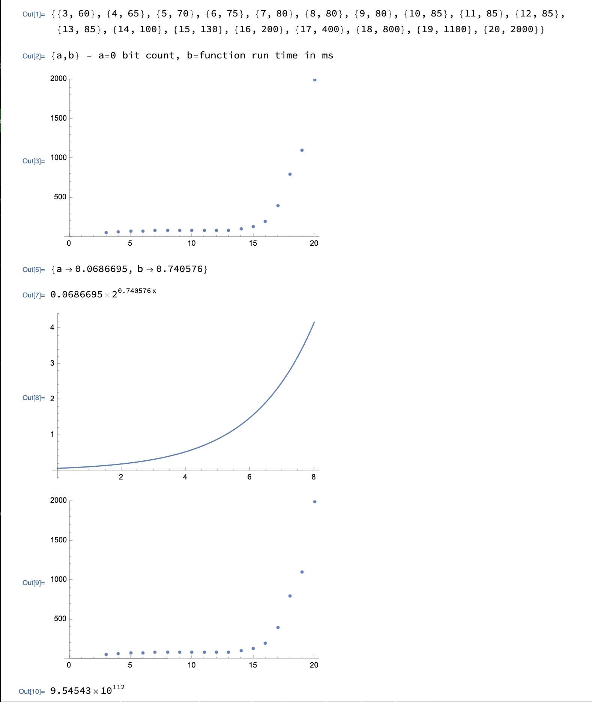

# **Random Message Generation and Hash Verification using OpenSSL** 🔒

## **Overview** 📄
This project provides a C++ implementation for generating random messages and verifying their hash values using the **`OpenSSL`** library. 
It demonstrates how to create messages, compute their hashes, and ensure the hashes meet specific criteria.

## **Key Functions and Their Purpose** 📌
### 1. **`controlHash`**:
- Checks if the given hash has a specified number of leading zero bits.
- Parameters:
    - `bits`: Number of leading zero bits to check.
    - `hash`: The hash value to be checked.
- Returns `1` if the hash meets the criteria, `0` otherwise.

### 2. **`convertToHex`**:
- Converts a binary input message to its hexadecimal representation.
- Parameters:
    - `output`: Pointer to store the hex output.
    - `input`: The binary input message.
    - `length`: Length of the binary input.
- Returns `1` on success, `0` on failure.

### 3. **`createMessage`**:
- Generates a random message based on the iteration number.
- Parameters:
    - `message`: Buffer to store the generated message.
    - `length`: Length of the message buffer.
    - `random`: Iteration number to influence message creation.

### 4. **`findHashEx`**:
- Generates a message and computes its hash, ensuring the hash has the specified number of leading zero bits.
- Parameters:
    - `bits`: Number of leading zero bits required.
    - `message`: Pointer to store the generated message in hex format.
    - `hash`: Pointer to store the computed hash in hex format.
    - `type`: The type of hash function to use (e.g., "sha512").
- Returns `1` on success, `0` on failure.

### 5. **`findHash`**:
- A specialized version of `findHashEx` that uses the "sha512" hash function.
- Parameters:
    - `bits`: Number of leading zero bits required.
    - `message`: Pointer to store the generated message in hex format.
    - `hash`: Pointer to store the computed hash in hex format.
- Returns `1` on success, `0` on failure.

### 6. **`checkHash`**:
- Placeholder function to check if a hash meets certain criteria.
- Parameters:
    - `bits`: Number of leading zero bits required.
    - `hash`: The hash value to be checked.
- Returns `1` (this function is not fully implemented).

## **Usage Example** 📘
```cpp
int main (void) {
    char * message, * hash;

    assert(findHash(0, &message, &hash) == 1);
    assert(message && hash && checkHash(0, hash));
    free(message);
    free(hash);

    assert(findHash(1, &message, &hash) == 1);
    assert(message && hash && checkHash(1, hash));
    free(message);
    free(hash);

    assert(findHash(2, &message, &hash) == 1);
    assert(message && hash && checkHash(2, hash));
    free(message);
    free(hash);

    assert(findHash(3, &message, &hash) == 1);
    assert(message && hash && checkHash(3, hash));
    free(message);
    free(hash);

    assert(findHash(-1, &message, &hash) == 0);

    return EXIT_SUCCESS;
}
```

## **Tools and Techniques Used** 🛠️
- **OpenSSL**:
    - Utilized for cryptographic functions, including hashing.
    - Key functions include `EVP_DigestInit_ex`, `EVP_DigestUpdate`, and `EVP_DigestFinal_ex` for hashing operations.
- **C++ Standard Library**:
    - Memory management using `malloc` and `free`.
    - String manipulation and input/output operations.
    - Algorithm and iteration for generating random messages.
- **Error Handling**:
    - Ensuring successful allocation of memory.
    - Validating the success of cryptographic operations.
    - Cleaning up resources in case of failure to prevent memory leaks.

## **Concepts Applied** 📚
- **Hashing**:
    - Using the **SHA-512** hash function to compute message digests.
- **Message Generation**:
    - Creating random messages and modifying them based on iteration.
- **Memory Management**:
    - Proper allocation and deallocation of resources to ensure no memory leaks.
- **Hexadecimal Conversion**:
    - Converting binary data to a human-readable hexadecimal format.

## **Performance Analysis** 📊
The performance of the message generation and hash verification process was analyzed. 
The image below shows the relationship between the number of bits to be zeroed and the function runtime.



## **Conclusion** 📝
This project demonstrates how to generate random messages and verify their hash values using `OpenSSL`, 
showcasing the integration of cryptographic techniques with standard C++ programming practices.
